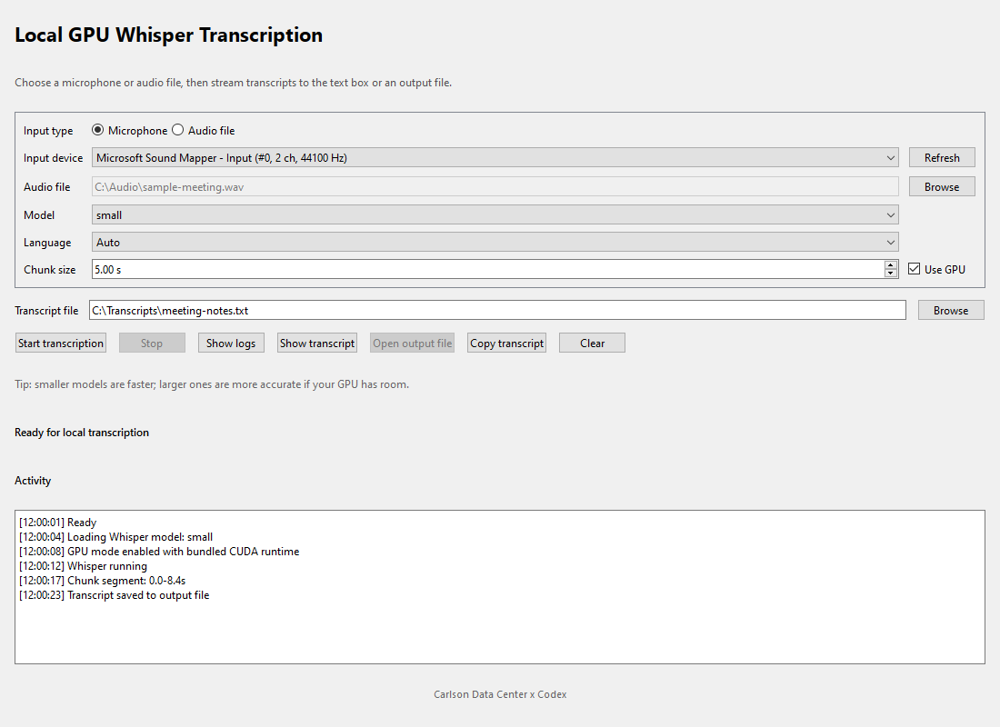

# Local GPU Whisper Transcriber GUI

A small Windows desktop app for live microphone transcription or one-off audio-file transcription with local Whisper inference.



## Built With

This app was built with help from OpenAI Codex.

## Download

Download the latest Windows installer from the GitHub Releases page:

https://github.com/CarlsonDataCenter/local-gpu-whisper-gui/releases

Run `LocalGPUWhisper-Setup.exe` and follow the installer prompts.

The installer includes the application, Python runtime dependencies, and the NVIDIA CUDA/cuDNN runtime DLLs used by the bundled Whisper backend. Users still need a compatible NVIDIA GPU driver installed separately for GPU mode.

## Features

- File transcription for common audio files such as WAV, MP3, M4A, FLAC, and similar formats supported by the bundled audio stack
- Live microphone transcription for recording and transcribing speech from a selected input device
- Local Whisper inference using `faster-whisper` and `ctranslate2`
- Whisper model selector for balancing speed and accuracy
- `Use GPU` toggle for NVIDIA GPU acceleration, with CPU fallback when GPU mode is unavailable
- Bundled CUDA 12/cuDNN runtime DLLs required by the app backend
- Static activity log inside the main window so you can see model loading, GPU fallback, chunks, and transcription progress
- Optional pop-out activity log window
- Optional pop-out live transcript window
- Output file picker for choosing where the transcript is saved
- `Open Output File` button after transcription finishes
- Copy and clear controls for the live transcript
- Windows installer with folder selection, shortcuts, and Programs and Features uninstall entry

## How To Use

1. Install the app with `LocalGPUWhisper-Setup.exe`.
2. Open `Local GPU Whisper Transcriber` from the Start Menu or Desktop shortcut.
3. Pick either `Audio file` mode or `Microphone` mode.
4. Choose the input file or microphone device.
5. Choose an output `.txt` file for the transcript.
6. Pick a Whisper model. Smaller models are faster; larger models are usually more accurate.
7. Leave `Use GPU` enabled if you have a supported NVIDIA GPU and driver, or turn it off to force CPU mode.
8. Click `Start Transcription`.
9. Watch the `Activity` box for model loading, chunk progress, GPU/CPU status, and completion messages.
10. When transcription finishes, click `Open Output File` to view the saved transcript.

## Audio File Mode

Use audio file mode when you already have a recording.

1. Select `Audio file`.
2. Click the input browse button and choose your audio file.
3. Choose where the transcript should be saved.
4. Click `Start Transcription`.

The app writes transcript text to the selected output file as it processes the audio and also shows transcript text in the UI.

## Microphone Mode

Use microphone mode for live speech transcription.

1. Select `Microphone`.
2. Choose your microphone/input device.
3. Choose where the transcript should be saved.
4. Click `Start Transcription`.
5. Speak into the selected microphone.
6. Click `Stop` when finished.

For live transcription, smaller models such as `small` or `medium` are recommended because they respond faster.

## Logs And Transcript Windows

- The main `Activity` box shows what the app is doing, including model loading, transcription chunks, CPU/GPU status, and errors.
- `Show Logs` opens a separate activity log window if you want more room.
- `Show Transcript` opens a separate live transcript window.
- These pop-out windows are optional and do not open automatically.

## Setup

1. Create a virtual environment if you want one.
2. Install dependencies:

```powershell
pip install -r requirements.txt
```

3. Run the app:

```powershell
python app.py
```

## Build EXE

If you have the bundled Python runtime used on this machine, you can build a standalone executable with:

```powershell
pyinstaller --noconsole --onefile --clean --name WhisperTranscriber --collect-all PySide6 --collect-all faster_whisper --collect-all ctranslate2 --collect-all onnxruntime --collect-all av --collect-all sounddevice app.py
```

## Production Installer

The production setup package requests Administrator permission so it can register with classic Windows Programs and Features, defaults to `%LOCALAPPDATA%\Local-GPU-Whisper`, lets users choose another install folder, shows install progress while extracting files, creates Desktop and Start Menu shortcuts, and registers an uninstall entry with publisher `Carlson Data Center`.

## Notes

- First run may download the selected Whisper model.
- For best results, use a CUDA-capable NVIDIA GPU and a smaller model like `small` or `medium` for real-time use.
- The packaged build bundles the NVIDIA CUDA 12/cuDNN runtime DLLs used by `ctranslate2`/`faster-whisper`, including `cublas64_12.dll` and `cudnn64_9.dll`.
- NVIDIA GPU drivers are not bundled. Install current NVIDIA display/GPU drivers from NVIDIA before using GPU mode.
- The file input mode accepts common audio formats. For microphone mode, the app captures at the device's rate and resamples before transcription.

## Software Sources

This project is built on top of several open-source and redistributable software components:

- Python: https://www.python.org/
- faster-whisper: https://github.com/SYSTRAN/faster-whisper
- CTranslate2: https://github.com/OpenNMT/CTranslate2
- PySide6 / Qt for Python: https://doc.qt.io/qtforpython-6/
- NumPy: https://numpy.org/
- sounddevice / PortAudio: https://python-sounddevice.readthedocs.io/ and https://www.portaudio.com/
- PyInstaller: https://pyinstaller.org/
- NVIDIA CUDA Toolkit runtime components: https://developer.nvidia.com/cuda-toolkit
- NVIDIA cuDNN runtime components: https://developer.nvidia.com/cudnn

The packaged installer bundles only the runtime components needed by the app where permitted by the relevant upstream terms. NVIDIA GPU drivers are not bundled.

## License

The application source code is released under the CDC OSS License 1.0. See `LICENSE`.

Third-party dependencies, NVIDIA CUDA/cuDNN runtime files, Qt/PySide components, Whisper model files, trademarks, and drivers remain governed by their own separate licenses and terms.

## Warranty

This software is provided as-is with zero warranties. Carlson Data Center and contributors are not responsible for transcription accuracy, data loss, hardware issues, driver issues, or any damages from using the software.
